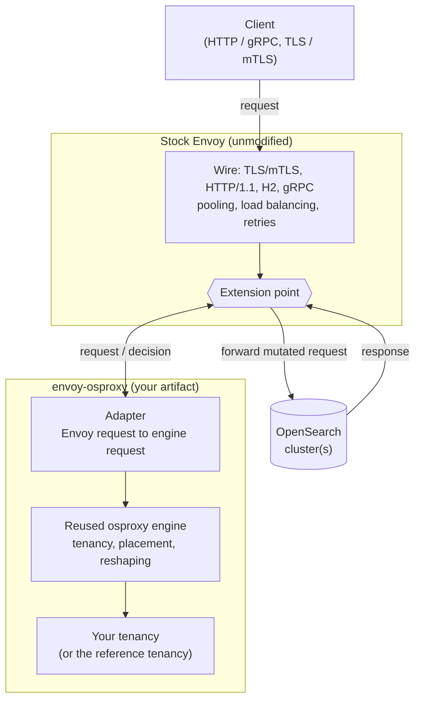
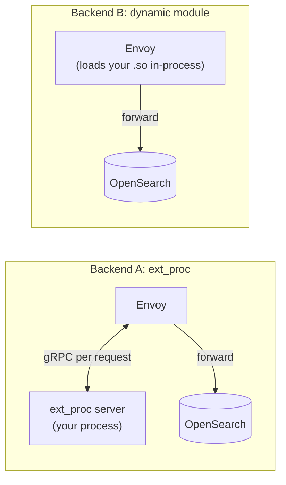
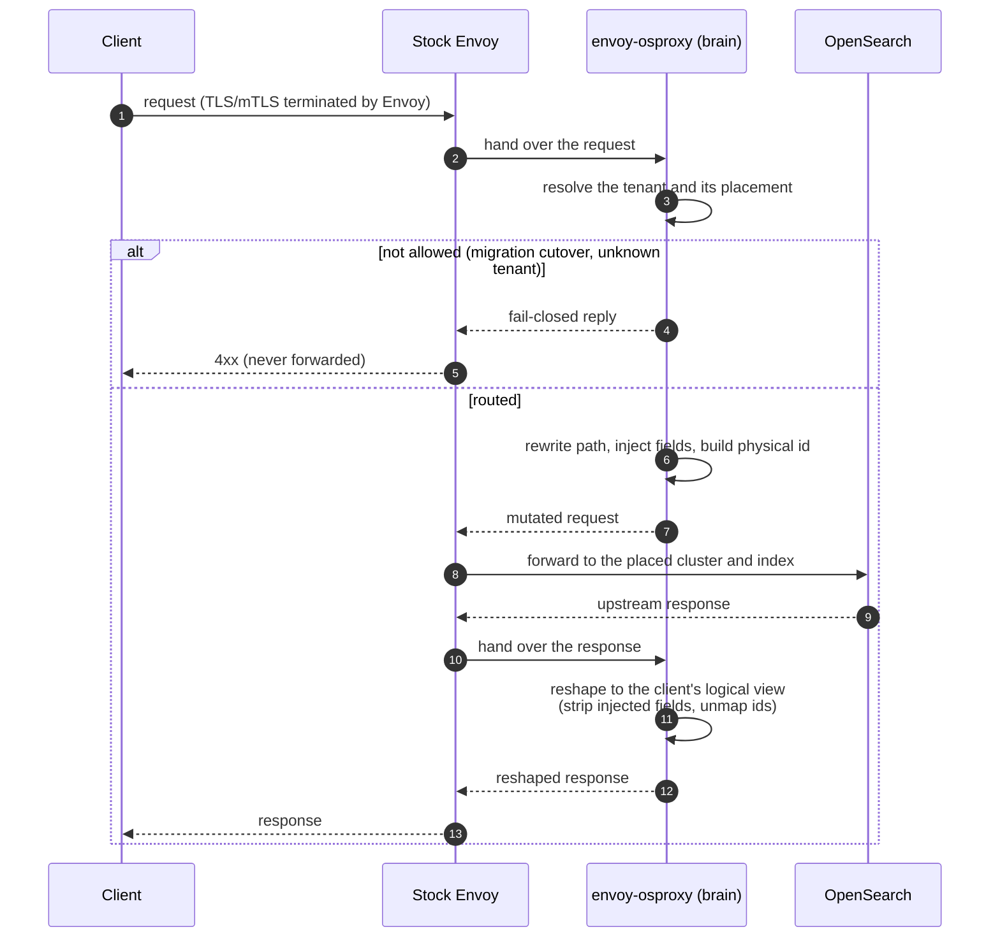

# Architecture

Envoy owns the wire, the reused osproxy engine is the brain, and a thin adapter
sits between them. Envoy terminates the connection and does the networking. Per
request it hands the message to our code, which asks the engine how to route and
reshape it, applies that decision, and lets Envoy forward to OpenSearch.

## High-level components

Click any diagram to zoom.

Stock Envoy is an unmodified `envoyproxy/envoy` release. It terminates TLS, speaks
every protocol, pools upstream connections, load-balances, and retries. We ship
none of that.

The adapter converts an Envoy request into the request the engine expects, and
applies the engine's decision back onto the Envoy message: rewrite the path, inject
fields, splice the body, or reply directly.

The reused osproxy engine decides tenancy and placement, then performs the request
and response transform. It is the same engine the standalone proxy runs.

Your tenancy is the one piece you write, or the built-in reference tenancy. It
answers which partition a request belongs to and where that partition is placed.

## The crates

The repository is a small set of crates with a strict one-way dependency direction.
`evoxy-abi` is the leaf; nothing internal depends on the backends.

| crate | role |
|---|---|
| [`evoxy-abi`](https://github.com/huyz0/envoy-osproxy/tree/main/crates/evoxy-abi) | The Envoy-facing wire model: `FilterRequest`, `FilterResponse`, `MtlsIdentity`. Both backends decode into these same types. |
| [`evoxy-adapter`](https://github.com/huyz0/envoy-osproxy/tree/main/crates/evoxy-adapter) | The seam. Turns a `FilterRequest` into the `RequestCtx` the engine consumes. |
| [`evoxy-route`](https://github.com/huyz0/envoy-osproxy/tree/main/crates/evoxy-route) | Transform-then-forward routing: resolve placement, rewrite the request, reshape the response. |
| [`evoxy-filter`](https://github.com/huyz0/envoy-osproxy/tree/main/crates/evoxy-filter) | The SDK-agnostic brain. Drives one request through adapter and route, issuing effects through an `EnvoyActions` trait the backends implement. |
| [`evoxy-extproc`](https://github.com/huyz0/envoy-osproxy/tree/main/crates/evoxy-extproc) | The ext_proc backend: an Envoy External Processing gRPC service over the brain. |
| [`evoxy-module`](https://github.com/huyz0/envoy-osproxy/tree/main/crates/evoxy-module) | The dynamic-module backend: a cdylib that binds Envoy's dynamic-modules SDK to the brain. |
| [`evoxy-bridge`](https://github.com/huyz0/envoy-osproxy/tree/main/crates/evoxy-bridge) | The async fan-out sink: turns a mirrored request into a Kafka record. |
| [`evoxy-bench`](https://github.com/huyz0/envoy-osproxy/tree/main/crates/evoxy-bench) | Dev-only benchmark math for the latency and scalability harnesses. |

The two backends (`evoxy-extproc` and `evoxy-module`) sit at the top and share the
one brain below them. Choosing a backend is a deployment decision, not a fork of
the logic.

## The two backends

The extension point is one of two stock Envoy mechanisms. The brain is identical;
only the transport differs.

ext_proc runs your logic in a separate gRPC service. You get process isolation and
an independent deploy, and you pay one out-of-process hop per request.

The dynamic module loads your logic as a shared library inside Envoy. There is no
hop, so it is the lower-latency option, and a crash takes the Envoy worker with it.

The [backend comparison](05-backends.md) has the measured trade-off.

## Main data flow

A request that needs isolation, such as a shared-index write or read, flows like
this. The transform happens on the way in, the reshape on the way out.

The brain never dispatches. It transforms the request and returns; Envoy forwards
to the upstream. Pooling, retries, and load balancing stay with Envoy.

The brain fails closed. If the tenant cannot be resolved or a write is held during
a migration, the request is rejected and never forwarded.

## Observability, in the same model

The introspection surfaces are served by the extension on Envoy's own port, so
there is no second server to run: a `/_evoxy/metrics` endpoint, a
`/_evoxy/explain/<target>` dry-run, and a shape-only routing-decision response
header. All of them carry only
counts, kinds, and flags, never tenant data.
