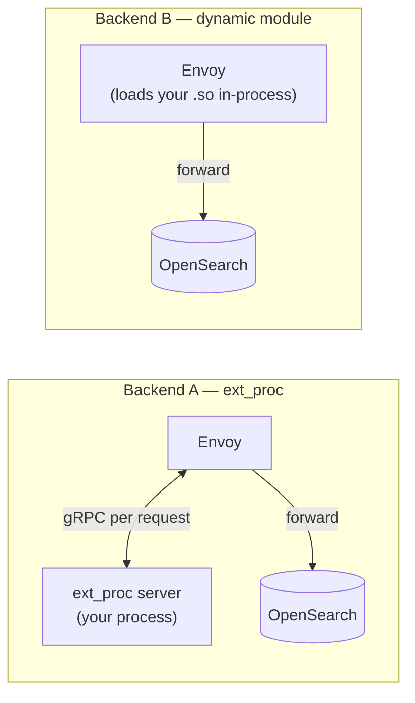
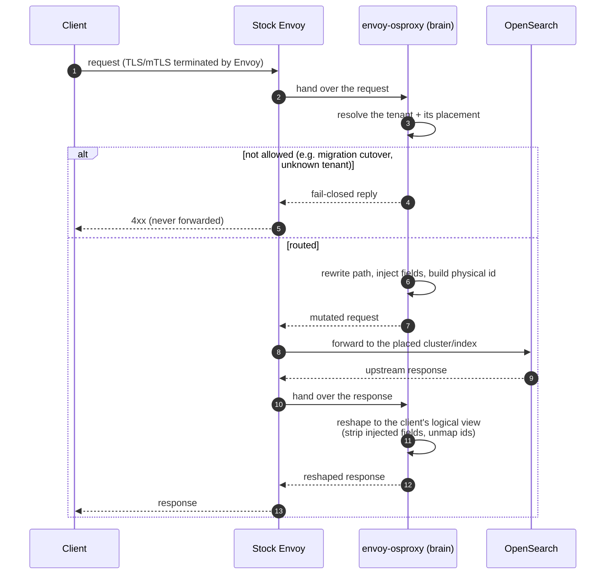

# Architecture

The one idea: **Envoy owns the wire, the reused osproxy engine is the brain, and a
thin adapter is the seam between them.** Envoy terminates the connection and does
all the networking; per request it hands the message to our code, which asks the
engine how to route and reshape it, then applies that decision and lets Envoy
forward to OpenSearch.

## High-level components

_(click any diagram to zoom)_

- **Stock Envoy** — an unmodified `envoyproxy/envoy` release. It terminates TLS,
  speaks every protocol, pools upstream connections, load-balances, and retries.
  We ship none of that.
- **The adapter** — converts an Envoy request into the exact request the engine
  expects, and applies the engine's decision (rewrite the path, inject fields,
  splice the body, or reply directly) back onto the Envoy message.
- **The reused osproxy engine** — decides tenancy and placement, and performs the
  request/response transform. It is the same engine the standalone proxy runs.
- **Your tenancy** — the one piece you write (or the built-in reference tenancy):
  which partition a request belongs to, and where it is placed.

## The two backends

The extension point is one of two stock Envoy mechanisms — the brain is identical,
only the transport differs:

- **ext_proc** runs your logic in a separate gRPC service — process isolation and
  an independent deploy, at the cost of one out-of-process hop per request.
- **dynamic module** loads your logic as a shared library inside Envoy — no hop,
  lowest latency, at the cost of a shared crash domain.

See [ext_proc vs. dynamic module](03-backends.md) for the measured trade-off.

## Main data flow

A request that needs isolation (for example, a shared-index write or read) flows
like this — the transform happens on the way in, the reshape on the way out:

Two things to note:

- **The brain never dispatches.** It transforms the request and returns; **Envoy**
  forwards to the upstream. That keeps pooling, retries, and load balancing with
  Envoy where they belong.
- **Fail-closed.** If the tenant cannot be resolved or a write is held during a
  migration, the request is rejected and never forwarded.

## Observability, in the same model

The introspection surfaces are served by the extension on Envoy's own port, so
there is no second server to run: a `/metrics` endpoint, a `/debug/explain`
dry-run, and a shape-only routing-decision response header — all of which carry
only counts, kinds, and flags, never tenant data.
