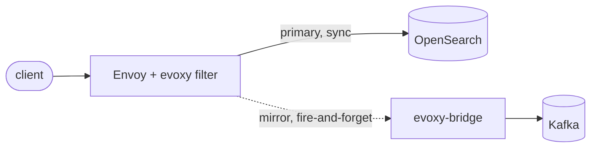

# Capture and async fan-out (no code)

Capture (audit, replay, analytics) and async fan-out (ship writes to Kafka for a
downstream applier) need no tenancy code. Both use one mechanism: Envoy's built-in
request mirroring shadows each request to a bridge, which produces it to Kafka. The
evoxy filter runs first, so the mirrored record is already the physical, isolated
request, the partition-scoped id and injected tenancy field included.

A related but distinct feature, async write mode, gives the client an immediate
`202` and skips the synchronous write; it is covered at the end of this page. Mirror
mode copies the write and keeps the synchronous path; async write mode replaces it.

This is a deliberate choice (ADR-005): an Envoy extension cannot cleanly produce to
Kafka from inside the request path, and a filter that blocked on a broker would add
the broker's latency and failure modes to every write. Mirroring keeps the write path
fast and the fan-out fire-and-forget.

## How it works



The filter transforms the request (physical index, partition-scoped id, injected
field). Envoy sends the transformed request to OpenSearch as normal, and its
`request_mirror_policies` shadow a copy to the bridge cluster. The client's response
comes from the primary; the mirror never affects it.

## What you configure

Two things, neither of which is an SPI:

A mirror policy on the Envoy route, pointing at a bridge cluster:

```yaml
route:
  cluster: opensearch
  request_mirror_policies:
    - cluster: bridge
```

The [evoxy-bridge](https://github.com/huyz0/envoy-osproxy/tree/main/crates/evoxy-bridge)
running as that bridge cluster. It receives the mirrored request and produces it as a
Kafka record, keyed by the request path so a document's records keep their order.
[`examples/capture-bridge`](https://github.com/huyz0/envoy-osproxy/tree/main/examples/capture-bridge)
is a complete, runnable bridge; swap its in-memory producer for osproxy's real
`KrafkaProducer` in production. The ready Envoy config is
[`examples/envoy/capture-fanout.yaml`](https://github.com/huyz0/envoy-osproxy/tree/main/examples/envoy/capture-fanout.yaml).

Mirroring is a route setting, so this works identically with either backend, the
dynamic module or ext_proc.

## Capture versus async fan-out

The wiring is the same; the difference is intent.

- Capture: mirror to a bridge that archives every request (a Kafka topic, an object
  store, an audit log). Add `runtime_fraction` to the mirror policy to sample a
  percentage rather than everything.
- Async fan-out: mirror writes to a bridge whose Kafka topic a downstream service
  consumes to apply the write elsewhere (a second cluster, a search replica, a
  materialized view). The record is the physical write, so the consumer needs no
  tenancy logic either.

Mirroring copies the write; it does not replace the synchronous write to OpenSearch.
The client still gets OpenSearch's real response. When you want the client to get an
immediate `202` and skip the synchronous write, that is async write mode, covered
next.

Ordering and delivery are the bridge's job, not Envoy's. Envoy mirrors
fire-and-forget with no retry; durability (a write-ahead log, acknowledged produce)
lives in the bridge, which is why it is a separate service you control rather than
filter code.

## Async write mode

Async write mode is the other thing you might mean by "async": the client sends a
write, gets an immediate `202 Accepted`, and the durable write happens off the
request path instead of synchronously against OpenSearch. Standalone osproxy has
this (ADR-010); evoxy offers it on both backends.

It is opt-in per request. Send the header:

```
x-evoxy-write-mode: async
```

on a write, and the backend runs the usual transform, then produces the physical
(transformed) request to a fan-out sink and answers `202`:

```json
{"status":"accepted","op_id":"3f2a9c1b7e40d5a8"}
```

The `op_id` is a shape-only correlation handle you can log. There is no proxy-side
status endpoint for it; the durable record is now the consumer's to apply.

You enable it by giving the backend a sink, any
[evoxy-bridge](https://github.com/huyz0/envoy-osproxy/tree/main/crates/evoxy-bridge)
over an acknowledging producer. The sink is code (a broker client is not config), so
this is one line in the artifact you already build.

On **ext_proc**, add it to the service:

```rust
let sink = Arc::new(Bridge::new(kafka_producer, "evoxy.writes"));
let service = ExtProcService::new(filter).with_async_write_sink(sink);
```

On the **dynamic module**, register with a sink factory instead of the plain
`register!` (see [`examples/async-module`](https://github.com/huyz0/envoy-osproxy/tree/main/examples/async-module)):

```rust
evoxy_module_sdk::register_async!(
    reference_filter,
    |_config: &str| Some(Arc::new(Bridge::new(kafka_producer, "evoxy.writes"))),
);
```

### The one rule: never lie about a 202

A `202` promises the write will happen, so evoxy sends it only after the broker
acknowledges the produce. That has consequences worth stating plainly:

- The acked produce is on the request path, so an async write waits for the broker,
  not for OpenSearch. This is the opposite trade from capture mirroring (which is
  fire-and-forget): async mode buys durable acceptance, not lower latency.
- If the broker does not acknowledge, evoxy refuses with `503 fanout_unavailable`
  rather than a false `202`. If no sink is configured it refuses with `503
  async_write_unavailable`; it never silently downgrades to a sync write.
- Async mode is for writes. The header on a read returns `400`.

### The module blocks its Envoy worker

Both backends await the broker ack, but where they wait differs, and it matters. The
ext_proc service blocks its own sidecar task. The dynamic module runs in-process, so
it blocks the Envoy worker thread the filter is on for the whole ack round-trip. That
can head-of-line block other connections on that worker, and it works against the
module's reason to exist (lowest latency). So async mode is off on the module until
you wire a sink, and you should only do so when that trade is acceptable. If you want
async writes without touching Envoy's worker latency, prefer ext_proc.
