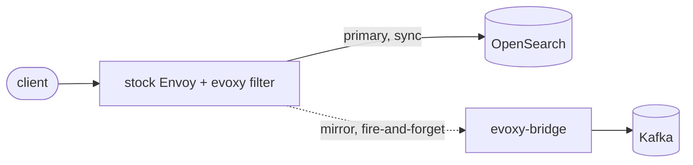

# Capture and async fan-out (no code)

Capture (audit, replay, analytics) and async fan-out (ship writes to Kafka for a
downstream applier) need no tenancy code. In evoxy they are the same mechanism:
Envoy's built-in request mirroring shadows each request to a bridge, which produces
it to Kafka. The evoxy filter runs first, so the mirrored record is already the
physical, isolated request, the partition-scoped id and injected tenancy field
included.

This is a deliberate choice (ADR-005): an Envoy extension cannot cleanly produce to
Kafka from inside the request path, and a filter that blocked on a broker would add
the broker's latency and failure modes to every write. Mirroring keeps the write path
fast and the fan-out fire-and-forget.

## How it works



The filter transforms the request (physical index, partition-scoped id, injected
field). Envoy sends the transformed request to OpenSearch as normal, and its
`request_mirror_policies` shadow a copy to the bridge cluster. The client's response
comes from the primary; the mirror never affects it.

## What you configure

Two things, neither of which is an SPI:

A mirror policy on the Envoy route, pointing at a bridge cluster:

```yaml
route:
  cluster: opensearch
  request_mirror_policies:
    - cluster: bridge
```

The [evoxy-bridge](https://github.com/huyz0/envoy-osproxy/tree/main/crates/evoxy-bridge)
running as that bridge cluster. It receives the mirrored request and produces it as a
Kafka record, keyed by the request path so a document's records keep their order.
[`examples/capture-bridge`](https://github.com/huyz0/envoy-osproxy/tree/main/examples/capture-bridge)
is a complete, runnable bridge; swap its in-memory producer for osproxy's real
`KrafkaProducer` in production. The ready Envoy config is
[`examples/envoy/capture-fanout.yaml`](https://github.com/huyz0/envoy-osproxy/tree/main/examples/envoy/capture-fanout.yaml).

Mirroring is a route setting, so this works identically with either backend, the
dynamic module or ext_proc.

## Capture versus async fan-out

The wiring is the same; the difference is intent.

- Capture: mirror to a bridge that archives every request (a Kafka topic, an object
  store, an audit log). Add `runtime_fraction` to the mirror policy to sample a
  percentage rather than everything.
- Async fan-out: mirror writes to a bridge whose Kafka topic a downstream service
  consumes to apply the write elsewhere (a second cluster, a search replica, a
  materialized view). The record is the physical write, so the consumer needs no
  tenancy logic either.

## What this is not

Mirroring copies the write; it does not replace the synchronous write to OpenSearch.
The client still gets OpenSearch's real response. If you want the client to get an
immediate `202` and skip the synchronous write entirely, that is a different feature
(an in-filter async-write mode) and is not part of the mirror-based fan-out here.

Ordering and delivery are the bridge's job, not Envoy's. Envoy mirrors
fire-and-forget with no retry; durability (a write-ahead log, acknowledged produce)
lives in the bridge, which is why it is a separate service you control rather than
filter code.
